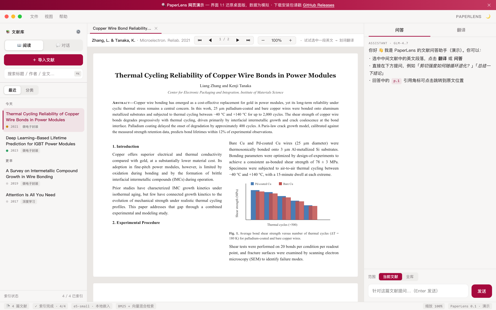
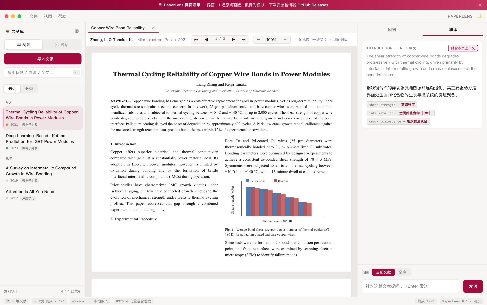
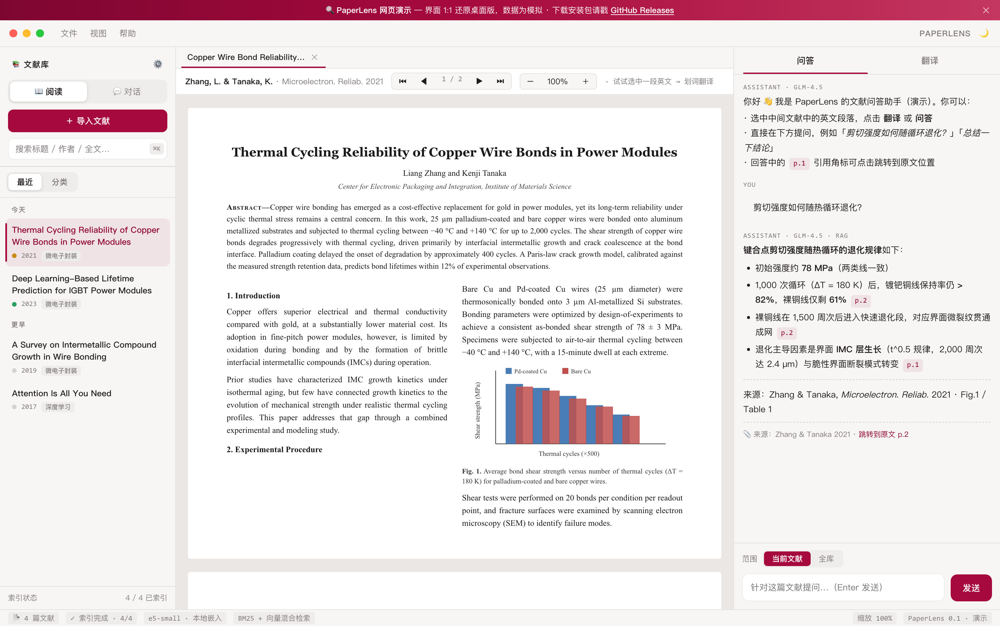
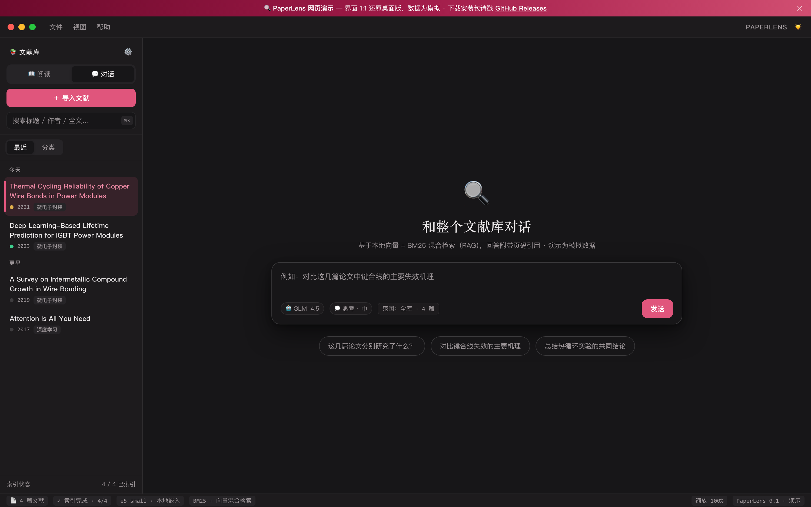

<div align="center">

# 🔍 PaperLens

### 让 AI 陪你读文献 —— 划词翻译 · 论文问答 · 全库对话

**PaperLens** 是一个面向科研人的桌面文献阅读器：把 PDF 文献库变成一个**可以对话的知识库**。
选中句子即译（术语结合上下文消歧），针对单篇论文提问（回答带页码引用、点击跳回原文），或者直接和整个文献库对话（本地向量 + BM25 混合检索 RAG）。

[](https://github.com/XinyuanLiao/paperlens/releases)
[](https://github.com/XinyuanLiao/paperlens/releases)
[](./LICENSE)
[](#-这个项目由-zcode-全程编写)

[](https://xinyuanliao.github.io/paperlens/)
[](https://github.com/XinyuanLiao/paperlens/releases)



</div>

---

## 🖥️ 先玩玩：30 秒在线体验

不想先装软件？**[网页演示版](https://xinyuanliao.github.io/paperlens/)** 在浏览器里 1:1 还原了桌面版的界面与交互，内置一篇示例文献，可以直接体验：

- 🖱️ **选中一段英文** → 浮条点「翻译」，看术语如何结合上下文消歧
- 💬 在右侧**直接提问**（试试"剪切强度如何随热循环退化？"），看流式回答与可点击的页码引用
- 💭 左栏切到「**对话**」模式，体验**全库 RAG 对话**的入口
- ⌨️ `⌘K / Ctrl+K` 打开命令面板，右上角切换深浅色主题

> 网页版为模拟数据、无需 API Key；桌面版可导入你自己的 PDF、接你自己的大模型。

---

## ✨ 三件核心本事

### 🌐 划词翻译 —— 术语级准确

选中句子，浮条一点即译。翻译时会把**当前页内容一并交给模型**做上下文消歧，所以 `bond wire` 会译成「键合线」而不是「结合线」；术语对照（原文 → 译名）直接附在译文下方，越读越快。



### 💬 论文问答 —— 回答带页码引用，一点跳回原文

针对当前文献全文提问（整篇进上下文，页码级引用）：回答流式输出，渲染 Markdown / 公式 / 表格 / 代码；每个结论旁的 `p.2` 引用角标都可点击，阅读器会**滚动到对应页面并高亮命中段落**——AI 说的每句话，都能回原文验证。



### 🧠 全库对话 —— 把整个文献库变成一个知识库

不打开任何 PDF，直接问"这几篇论文分别研究了什么？""对比键合线失效的主要机理"。两层混合检索（段落级：本地向量 + BM25；文献级：标题/首页向量补全）保证相关文献不被漏掉，回答附带**跨文献的页码引用**，检索范围可按 全库 / 分类 / 当前文献 切换。



---

## 🎨 现代化的界面设计

PaperLens 的界面参考了 Zed（安静的表面、发丝线分隔）、Linear（信息密度与排版）与 Raycast（命令面板）的设计语言，为「长时间阅读」而设计：

- 🌗 深 / 浅色主题，跟随系统
- ⌨️ `⌘K / Ctrl+K` 命令面板，键盘优先
- 🪟 多标签页阅读、触控板捏合缩放、可拖宽的三栏布局
- 🖍️ 划词高亮（持久化保存，点击即删）
- 📚 文献库自动索引：最近 / 分类视图、拖拽归类、AI 导入时**按篇推荐分类**、iCloud / OneDrive 多设备同步自动重新扫描

---

## 🤖 这个项目由 ZCode 全程编写

PaperLens 的**每一行代码**——从第一版 PDF 阅读器，到 RAG 混合检索、双模式界面、双平台打包——都由 AI 编程智能体 **ZCode** 完成。人类只做两件事：**提需求、验收**。

| | |
|---|---|
| ⏱️ 从第一行代码到发布就绪 | **3 天**（2026.09.12 → 09.14） |
| 📝 提交次数 | **28 次**，全部由 ZCode 完成 |
| 📏 核心代码 | **约 6,900 行** TypeScript / React / Electron |
| 🧑‍💻 人工编写 | **0 行** |

```
09-12 10:45  PaperLens 0.1: PDF reader, selection translate, LLM chat, RAG, highlights
09-12 12:41  Modern desktop redesign: command palette (Ctrl/Cmd+K), full-bleed Zed-style layout…
09-13 …      Dual-mode UI: Read/Chat toggle, library-wide chat, onboarding wizard…
09-14 …      Full-paper QA mode, true citation jump, per-paper import classification…
09-14 14:06  Fix 8 reported issues: markdown rendering, citation jump precision…
```

> 整个开发过程是一个真实的人机协作样本：作者用自然语言描述问题与期望，ZCode 负责理解、实现、调试、重构，直至打包出 macOS 与 Windows 安装包。提交历史就是完整的"对话记录"。

---

## 📦 下载安装

安装包已放在 [**Releases**](https://github.com/XinyuanLiao/paperlens/releases)，开箱即用：

| 平台 | 文件 |
|---|---|
| macOS（Apple Silicon / Intel） | `PaperLens-<版本>-arm64.dmg` / `-x64.dmg` |
| Windows (x64) | `PaperLens Setup <版本>.exe` |

> 未做代码签名：Windows 首次运行 SmartScreen 提示时选「仍要运行」；macOS 首次打开若提示无法验证开发者，右键 App →「打开」，或执行 `xattr -cr /Applications/PaperLens.app`。
>
> 首次启动有向导：选一个文献库文件夹 → 填任一大模型 API Key（智谱 / DeepSeek / 通义 / Kimi / OpenAI / 任意兼容服务 / Ollama）→ 选择嵌入模型（默认本地 `multilingual-e5-small`，约 130 MB，自动下载）。不填 Key 也能用阅读与管理功能。

<details>
<summary><b>🛠 从源码构建（开发者）</b></summary>

```bash
npm install
npm run rebuild   # 重建 better-sqlite3 的 Electron 绑定
npm run dev
```

前置要求：Node 20+；macOS 需 Xcode Command Line Tools，Windows 需 VS Build Tools + Python 3。

```bash
npm run dist:mac   # dist/PaperLens-<版本>-arm64.dmg / -x64.dmg
npm run dist:win   # dist/PaperLens Setup <版本>.exe（NSIS）
```

</details>

---

## 🧰 技术栈

| 层 | 技术 |
|---|---|
| 桌面框架 | Electron + Vite |
| 界面 | React + TypeScript（无 UI 库，手写设计系统） |
| PDF 渲染 | pdf.js（双栏论文、CJK cmap 完整支持） |
| 存储 | better-sqlite3（FTS5 全文检索，单文件本地库） |
| 嵌入 | transformers.js（`multilingual-e5-small` 本地推理）/ Ollama / 智谱 |
| 检索 | 段落级：向量 + BM25 混合；文献级：标题/首页向量补全 |
| 大模型 | 任意 OpenAI 兼容接口，多服务商配置档案 |

## 🔐 隐私与数据

- API Key、文献库、索引、高亮、对话记录**全部保存在本地**（SQLite + 本地文件），不上传任何服务器
- 嵌入模型默认在**本机推理**；配合 Ollama 对话可实现完全离线使用
- 代码库已做敏感信息审查，不含任何密钥或个人信息

---

## 📄 许可证

本项目采用 **[PolyForm Noncommercial 1.0.0](./LICENSE)**（不可商用）许可证：

- ✅ **可以**：个人学习、科研、教学使用；自由修改、二次开发、分发（须保留本许可证与版权声明）
- ❌ **不可以**：任何以商业为目的的使用——包括销售本软件、将其整合进付费产品或付费服务
- 💼 商业授权请通过 GitHub 联系作者

界面截图来自网页演示版，示例文献为演示用虚构内容。

---

<div align="center">

**如果 PaperLens 对你的科研有用，欢迎点一个 ⭐ Star —— 这是对"ZCode 全程编写"最好的注脚**

[](https://github.com/XinyuanLiao/paperlens)

</div>
